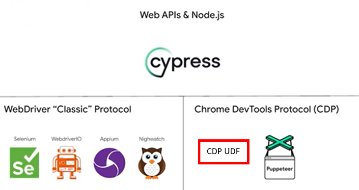
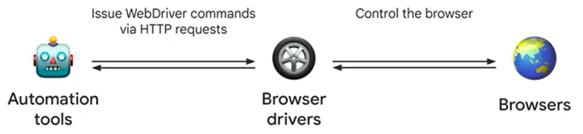
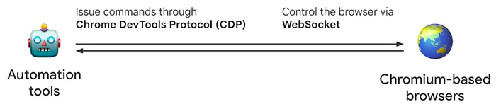

<p align="center">
  
</p>
<h3 align="center">AutoIt CDP UDF</h3>
<p align="center">
  
  
  
  
  
  
</p>

<p align="center">
  <a href="#description">Description</a> •
  <a href="#features">Features</a> •
  <a href="#requirements">Requirements</a> •
  <a href="#getting-started">Getting Started</a> •
  <a href="#configuration">Configuration</a> •
  <a href="#license">License</a> •
  <a href="#acknowledgements">Acknowledgements</a>
</p>

## Description

A modern, high‑performance, simple-to-use AutoIt UDF for browser automation using the **Chrome DevTools Protocol (CDP)**.

This library provides a Playwright‑style API for controlling Chromium‑based browsers directly over CDP — **no WebDriver required**.

The goal of this project is to bring a clean, fluent, reliable automation experience to AutoIt, with first‑class support for:

- Locators  
- Assertions  
- Page interactions
- Test framework
- Network interception ¹ 
- JavaScript evaluation ¹ 
- Event handling ¹ 

¹ not developed

If you’ve used Playwright or Puppeteer, the API will feel instantly familiar.

### How is this different from other automation tools

The CDP UDF automates the browser directly through the browser's developer tools (DevTools) protocol.<br>
<p align="left">
  
</p>
The traditional way to automate via a web driver:<br><br>
<p align="left">
  
</p>
The modern way to automate via devtools protocol and the CDP UDF:<br><br>
<p align="left">
  
</p>

More detail on modern CDP and BiDi automation in this [Youtube video](https://youtu.be/6oXic6dcn9w?si=vj2kMVGlj9cl0oDe).

## Features

- Direct CDP communication (no WebDriver, no Selenium) via WebSockets
- Playwright‑inspired API
- Extremely light (no bulky tech stack, no Python, no Node.js, no ChromeDriver, no npm, no reporters, no trace viewers)
- Extremely fast script runs
- Auto‑waiting for elements and conditions ¹
- Built‑in assertion system (`expect()`)
- Support for:
  - navigation
  - clicking
  - typing
  - filling
  - evaluating JavaScript ¹
  - retrieving attributes, text, values
  - checking visibility, enabled/disabled, checked state
- Network request/response interception ¹
- Object-driven test-aware scripts
- Event‑driven architecture
- Works with Chrome, Edge, Brave, Chromium ²
- Automatic browser download via Selenium Manager
- Portable self-contained dependency-free zero-install scripts (executables) that can automate Chrome on any Windows machine

¹ not developed<br>
² currently only chrome supported

### Comparing CDP UDF to Playwright

    ✔️ = developed
    ❌ = not developed    

### Test Runner & Assertions

| Feature name | CDP UDF | Playwright |
| --- | --- | --- |
| **Test runner included** | ✔️ | ✔️ |
| ``test`` object | ✔️ | ✔️ |
| ``test.step()`` | ✔️ | ✔️ |
| ``test.expect()`` | ✔️ | ✔️ |
| ``test.describe()`` | ❌ | ✔️ |
| ``test.beforeEach()`` | ❌ | ✔️ |
| ``test.afterEach()`` | ❌ | ✔️ |
| **Parallel test execution** | ❌ | ✔️ |
| **Automatic trace viewer** | ❌ | ✔️ |
| **Automatic HTML report** | ❌ | ✔️ |    

### Locator‑Creation Methods

| Feature name | CDP UDF | Playwright | CDP Commands |
| --- | --- | --- | --- |
| ``locator(selector)`` | ✔️ | ✔️ | No CDP — internal selector logic |
| ``filter`` | ❌ | ✔️ | No CDP — internal selector logic |
| ``nth()`` | ❌ | ✔️ | No CDP — internal selector logic |
| ``first()`` | ❌ | ✔️ | No CDP — internal selector logic |
| ``last()`` | ❌ | ✔️ | No CDP — internal selector logic |
| ``getByRole()`` | ❌ | ✔️ | No CDP — internal selector logic |
| ``getByText()`` | ❌ | ✔️ | No CDP — internal selector logic |
| ``getByLabel()`` | ❌ | ✔️ | No CDP — internal selector logic |
| ``getByPlaceholder()`` | ❌ | ✔️ | No CDP — internal selector logic |
| ``getByAltText()`` | ❌ | ✔️ | No CDP — internal selector logic |
| ``getByTitle()`` | ❌ | ✔️ | No CDP — internal selector logic |
| ``getByTestId()`` | ❌ | ✔️ | No CDP — internal selector logic |

### Locator Action Methods

| Feature name | CDP UDF | Playwright | CDP Commands |
| --- | --- | --- | --- |
| ``click()`` | ✔️¹ | ✔️ | DOM.getBoxModel<br>Input.dispatchMouseEvent<br>Runtime.callFunctionOn |
| ``dblclick()`` | ❌ | ✔️ | same as click (twice) |
| ``hover()`` | ❌ | ✔️ | DOM.getBoxModel<br>Input.dispatchMouseEvent |
| ``tap()`` | ❌ | ✔️ | Input.dispatchTouchEvent |
| ``fill()`` | ✔️ | ✔️ | DOM.focus<br>Input.insertText<br>Runtime.callFunctionOn |
| ``type()`` | ❌ | ✔️ | Input.dispatchKeyEvent |
| ``press()`` | ❌ | ✔️ | Input.dispatchKeyEvent |
| ``check()`` | ❌ | ✔️ | Runtime.callFunctionOn<br>Input.dispatchMouseEvent |
| ``uncheck()`` | ❌ | ✔️ | Runtime.callFunctionOn<br>Input.dispatchMouseEvent |
| ``setChecked()`` | ❌ | ✔️ | ?
| ``selectOption()`` | ❌ | ✔️ | Runtime.callFunctionOn<br>DOM.dispatchEvent |
| ``focus()`` | ❌ | ✔️ | DOM.focus |
| ``blur()`` | ❌ | ✔️ | Runtime.callFunctionOn |
| ``clear()`` | ❌ | ✔️ | Runtime.callFunctionOn |
| ``dragTo()`` | ❌ | ✔️ | DOM.getBoxModel<br>Input.dispatchMouseEvent |
| ``setInputFiles()`` | ❌ | ✔️ | DOM.setFileInputFiles |
| ``dispatchEvent()`` | ❌ | ✔️ | DOM.dispatchEvent |
| ``scrollIntoViewIfNeeded()`` | ❌ | ✔️ | DOM.scrollIntoViewIfNeeded<br>Runtime.callFunctionOn |

¹ partially done

### Locator Getter Methods

| Feature name | CDP UDF | Playwright | CDP Commands |
| --- | --- | --- | --- |
| ``textContent()`` | ✔️ | ✔️ | Runtime.callFunctionOn |
| ``innerText()`` | ✔️ | ✔️ | Runtime.callFunctionOn |
| ``innerTextCRStripped()`` | ✔️ | ❌ | Runtime.callFunctionOn |
| ``innerTextLFStripped()`` | ✔️ | ❌ | Runtime.callFunctionOn |
| ``innerTextReplace()`` | ✔️ | ❌ | Runtime.callFunctionOn |
| ``innerHTML()`` | ✔️ | ✔️ | Runtime.callFunctionOn |
| ``inputValue()`` | ✔️ | ✔️ | Runtime.callFunctionOn |
| ``getAttribute()`` | ✔️ | ✔️ | Runtime.callFunctionOn |
| ``boundingBox()`` | ❌ | ✔️ | DOM.getBoxModel |
| ``screenshot()`` | ❌ | ✔️ | DOM.getBoxModel<br>Page.captureScreenshot |
| ``evaluate()`` | ❌ | ✔️ | Runtime.callFunctionOn |
| ``evaluateAll()`` | ❌ | ✔️ | Runtime.callFunctionOn |
| ``elementHandle()`` | ❌ | ✔️ | DOM.resolveNode |
| ``allInnerTexts()`` | ❌ | ✔️ | Runtime.callFunctionOn |
| ``allTextContents()`` | ❌ | ✔️ | Runtime.callFunctionOn |
| ``count()`` | ❌ | ✔️ | DOM.querySelectorAll |

### Locator State Methods

| Feature name | CDP UDF | Playwright | CDP Commands |
| --- | --- | --- | --- |
| ``isVisible()`` | ✔️ | ✔️ | Runtime.callFunctionOn, DOM.getBoxModel |
| ``isHidden()`` | ✔️ | ✔️ | same as isVisible |
| ``isEnabled()`` | ✔️ | ✔️ | Runtime.callFunctionOn |
| ``isDisabled()`` | ✔️ | ✔️ | Runtime.callFunctionOn |
| ``isEditable()`` | ✔️ | ✔️ | Runtime.callFunctionOn |
| ``isChecked()`` | ✔️ | ✔️ | Runtime.callFunctionOn |

### Locator Waiting Methods

| Feature name | CDP UDF | Playwright | CDP Commands |
| --- | --- | --- | --- |
| ``waitFor()`` | ❌ | ✔️ | DOM.querySelector<br>Runtime.callFunctionOn<br>DOM.getBoxModel
| ``waitForElementState()`` | ❌ | ✔️ | Runtime.callFunctionOn<br>DOM.getBoxModel
| ``waitForSelector()`` | ❌ | ✔️ | DOM.querySelector<br>DOM.querySelectorAll

### Locator‑Based Expect Methods

| Feature name | CDP UDF | Playwright | Uses |
| --- | --- | --- | --- |
| ``expect(locator).toBeVisible()`` | ✔️ | ✔️ | isVisible() |
| ``expect(locator).toBeHidden()`` | ✔️ | ✔️ | isHidden() |
| ``expect(locator).toBeEnabled()`` | ✔️ | ✔️ | isEnabled() |
| ``expect(locator).toBeDisabled()`` | ✔️ | ✔️ | isDisabled() |
| ``expect(locator).toBeChecked()`` | ✔️ | ✔️ | isChecked() |
| ``expect(locator).toHaveText()`` | ✔️ | ✔️ | textContent() |
| ``expect(locator).toContainText()`` | ✔️ | ✔️ | textContent() |
| ``expect(locator).toHaveAttribute()`` | ✔️ | ✔️ | getAttribute() |
| ``expect(locator).toHaveClass()`` | ❌ | ✔️ | |
| ``expect(locator).toHaveCount()`` | ❌ | ✔️ | |
| ``expect(locator).toHaveValue()`` | ❌ | ✔️ | |
| ``expect(locator).toHaveJSProperty()`` | ❌ | ✔️ | |

### Value‑Based Expect Methods

| Feature name | CDP UDF | Playwright |
| --- | --- | --- |
| ``expect(value).toBe()`` | ✔️ | ✔️ |
| ``expect(value).toEqual()`` | ❌ | ✔️ |
| ``expect(value).toStrictEqual()`` | ❌ | ✔️ |
| ``expect(value).toBeGreaterThan()`` | ✔️ | ✔️ |
| ``expect(value).toBeGreaterThanOrEqual()`` | ✔️ | ✔️ |
| ``expect(value).toBeLessThan()`` | ✔️ | ✔️ |
| ``expect(value).toBeLessThanOrEqual()`` | ✔️ | ✔️ |
| ``expect(value).toBeCloseTo()`` | ✔️¹ | ✔️ |
| ``expect(value).toContain()`` | ✔️ | ✔️ |
| ``expect(value).toMatch()`` | ✔️ | ✔️ |
| ``expect(value).toBeTruthy()`` | ✔️ | ✔️ |
| ``expect(value).toBeFalsy()`` | ✔️ | ✔️ |
| ``expect(value).toBeNull()`` | ✔️ | ✔️ |
| ``expect(value).toBeDefined()`` | ✔️ | ✔️ |
| ``expect(value).toBeUndefined()`` | ✔️¹ | ✔️ |
| ``expect(value).toContainEqual()`` | ❌ | ✔️ |
| ``expect(value).toHaveLength()`` | ✔️ | ✔️ |
| ``expect(value).toThrow()`` | ❌ | ✔️ |

¹ untested

### Browser / Page Features

| Feature name | CDP UDF | Playwright |
| --- | --- | --- |
| **Launch Chromium** | ✔️ | ✔️ |
| **Connect to existing browser** | ✔️ | ✔️ |
| **Multiple contexts** | ❌ | ✔️ |
| **Multiple pages** | ✔️ | ✔️ |
| **Tracing** | ❌ | ✔️ |
| **HAR recording** | ❌ | ✔️ |
| **Network interception** | ✔️ | ✔️ |
| **Console event capture** | ✔️ | ✔️ |
| **Dialog handling** | ✔️ | ✔️ |
| **Screenshot** | ✔️ | ✔️ |
| **PDF generation** | ❌ | ✔️ |
| **Video recording** | ❌ | ✔️ |

## Requirements

- AutoIt v3.3.16.0 or later  
- AutoItObject UDF  
- JsonC UDF
- Curl UDF 
- Chromium‑based browser with remote debugging enabled

## Getting Started

Try the following examples from the main folder that demonstrate the UDF functions.

| Script | Features Included |
| --- | --- |
| Example Chrome Default.au3 | Test of a basic web page using default "pre-installed" Chrome browser |
| Example Chrome Default Headless.au3 | Test of a basic web page using default "pre-installed" Chrome browser & headless mode |
| Example Chrome v119.au3 | Test of a basic web page using an "auto-installed" Chrome browser v119 |
| Example Playwright Chrome.au3 | Test of a basic web page using optionally installed Playwright Chromium browser |
| Example Playwright Headless Chrome.au3 | Basic Web Page test using optionally installed Playwright Chromium Headless Shell |
| Example Element Attributes.au3 | Test of web element attributes |
| Example Element Attributes Debug.au3 | Test of web element attributes with debugging enabled |
| Example Multiple Elements.au3 | Test of multiple web elements |
| Example Basic Inputs.au3 | Test of basic HTML input elements |
| Example Number Inputs.au3 | Test of numeric HTML input elements |

### Example script

```text
#include "CDP.au3"

$chrome = $browser.launch(Default, 9299, Default, Default, "1280,800")
$page = $chrome.page()

With test("Multiple Elements test")

	teststep("Navigate to the page")
	$page.goto("https://testpages.eviltester.com/pages/basics/multiple-elements-example/")
	$submitBtn = $page.locator("//button[@id='submitBtn']")

	With teststep("Verify the submit button is disabled")
		.expect($submitBtn.isDisabled()).toBe(True, @ScriptLineNumber)
		.expect($submitBtn.isEnabled()).toBe(False, @ScriptLineNumber)
		.expect($submitBtn).toBeDisabled(@ScriptLineNumber)
	EndWith

	With teststep("Verify the manager radio button state change")
		$manager = $page.locator("//input[@id='manager']")
		.expect($manager.isChecked()).toBe(False, @ScriptLineNumber)
		$manager.click()
		.expect($manager.isChecked()).toBe(True, @ScriptLineNumber)
		.expect($manager).toBeChecked(@ScriptLineNumber)
	EndWith

	With teststep("Verify the submit button is now enabled")
		.expect($submitBtn.isDisabled()).toBe(False, @ScriptLineNumber)
		.expect($submitBtn.isEnabled()).toBe(True, @ScriptLineNumber)
		.expect($submitBtn).toBeEnabled(@ScriptLineNumber)
	EndWith

EndWith

$chrome.close()
```

### Example output 

```text
▶ Test: Multiple Elements test
  ▶ Step: Navigate to the page
  ▶ Step: Verify the submit button is disabled
      ✓ Expect: expected [True] and got [True] (line 17)
      ✓ Expect: expected [False] and got [False] (line 18)
      ✓ Expect: object [-1337934554965411348.1.3] is disabled (line 19)
  ▶ Step: Verify the manager radio button state change
      ✓ Expect: expected [False] and got [False] (line 24)
      ✓ Expect: expected [True] and got [True] (line 26)
      ✓ Expect: object [-1337934554965411348.1.4] is checked (line 27)
  ▶ Step: Verify the submit button is now enabled
      ✓ Expect: expected [False] and got [False] (line 31)
      ✓ Expect: expected [True] and got [True] (line 32)
      ✓ Expect: object [-1337934554965411348.1.7] is enabled (line 33)
```

## Configuration

The AutoIT SciTE script editor does not have UTF8 / Unicode support enabled by default.  This is required to display the unicode characters (like ▶✓) in the test output (see the "Example output" above).

To enable this in the AutoIT editor add the following line to your **SciTEUser.properties** file (via menu **Options > Open User Options File**) :

<code>output.code.page=65001</code>

## License

Distributed under the MIT License. See [LICENSE] for more information.

## Acknowledgements

- Opportunity by [GitHub](https://github.com)
- Badges by [Shields](https://shields.io)
- Thanks to the authors of the Third-Party UDFs
  - [AutoItObject](https://www.autoitscript.com/forum/topic/110379-autoitobject-udf) by the AutoItObject-Team (monoceres, trancexx, Kip and progandy)
  - [JsonC](https://github.com/seanhaydongriffin/JsonC-UDF) by Sean Griffin
  - [Curl](https://www.autoitscript.com/forum/topic/173067-curl-udf-autoit-binary-code-version-of-libcurl-with-ssl-support) by Ward and modified by Beege and Sean Griffin
- Thanks to Microsoft Copilot for being my every-optimistic coding-buddy 24/7

