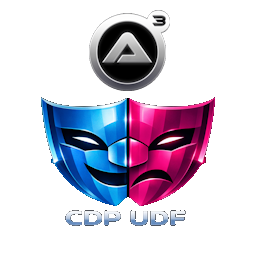

  

<h3 align="center">AutoIT CDP UDF</h3>

  
  
  
  
  

  <a href="#description">Description</a> •
  <a href="#features">Features</a> •
  <a href="#requirements">Requirements</a> •
  <a href="#getting-started">Getting Started</a> •
  <a href="#configuration">Configuration</a> •
  <a href="#license">License</a> •
  <a href="#acknowledgements">Acknowledgements</a>

## Description

A modern, high‑performance AutoIt UDF for browser automation using the **Chrome DevTools Protocol (CDP)**.  
This library provides a Playwright‑style API for controlling Chromium‑based browsers directly over CDP — **no WebDriver required**.

The goal of this project is to bring a clean, fluent, reliable automation experience to AutoIt, with first‑class support for:

- Locators  
- Assertions  
- Page interactions  
- Network interception  
- JavaScript evaluation  
- Event handling  

If you’ve used Playwright or Puppeteer, the API will feel instantly familiar.

## Features

- Direct CDP communication (no WebDriver, no Selenium) via WebSockets
- Playwright‑inspired Locator API
- Auto‑waiting for elements and conditions ¹
- Built‑in assertion system (`expect()`)
- Support for:
  - navigation
  - clicking
  - typing
  - filling
  - evaluating JavaScript ¹
  - retrieving attributes, text, values
  - checking visibility, enabled/disabled, checked state
- Network request/response interception ¹
- Event‑driven architecture
- Works with Chrome, Edge, Brave, Chromium ²

¹ not developed 
² currently only chrome supported

### Comparing CDP UDF to Playwright

    ✔️ = supported
    ❌ = not supported    

### Test Runner & Assertions

| Feature name | CDP UDF | Playwright |
| --- | --- | --- |
| **Test runner included** | ✔️ | ✔️ |
| ``test`` object | ✔️ | ✔️ |
| ``test.step()`` | ✔️ | ✔️ |
| ``test.expect()`` | ✔️ | ✔️ |
| ``test.describe()`` | ❌ | ✔️ |
| ``test.beforeEach()`` | ❌ | ✔️ |
| ``test.afterEach()`` | ❌ | ✔️ |
| **Parallel test execution** | ❌ | ✔️ |
| **Automatic trace viewer** | ❌ | ✔️ |
| **Automatic HTML report** | ❌ | ✔️ |    

### Locator‑Creation Methods

| Feature name | CDP UDF | Playwright | CDP Commands |
| --- | --- | --- | --- |
| ``locator(selector)`` | ✔️ | ✔️ | No CDP — internal selector logic |
| ``filter`` | ❌ | ✔️ | No CDP — internal selector logic |
| ``nth()`` | ❌ | ✔️ | No CDP — internal selector logic |
| ``first()`` | ❌ | ✔️ | No CDP — internal selector logic |
| ``last()`` | ❌ | ✔️ | No CDP — internal selector logic |
| ``getByRole()`` | ❌ | ✔️ | No CDP — internal selector logic |
| ``getByText()`` | ❌ | ✔️ | No CDP — internal selector logic |
| ``getByLabel()`` | ❌ | ✔️ | No CDP — internal selector logic |
| ``getByPlaceholder()`` | ❌ | ✔️ | No CDP — internal selector logic |
| ``getByAltText()`` | ❌ | ✔️ | No CDP — internal selector logic |
| ``getByTitle()`` | ❌ | ✔️ | No CDP — internal selector logic |
| ``getByTestId()`` | ❌ | ✔️ | No CDP — internal selector logic |

### Locator Action Methods

| Feature name | CDP UDF | Playwright | CDP Commands |
| --- | --- | --- | --- |
| ``click()`` | ❌¹ | ✔️ | DOM.getBoxModel Input.dispatchMouseEvent Runtime.callFunctionOn |
| ``dblclick()`` | ❌ | ✔️ | same as click (twice) |
| ``hover()`` | ❌ | ✔️ | DOM.getBoxModel Input.dispatchMouseEvent |
| ``tap()`` | ❌ | ✔️ | Input.dispatchTouchEvent |
| ``fill()`` | ✔️ | ✔️ | DOM.focus Input.insertText Runtime.callFunctionOn |
| ``type()`` | ❌ | ✔️ | Input.dispatchKeyEvent |
| ``press()`` | ❌ | ✔️ | Input.dispatchKeyEvent |
| ``check()`` | ❌ | ✔️ | Runtime.callFunctionOn Input.dispatchMouseEvent |
| ``uncheck()`` | ❌ | ✔️ | Runtime.callFunctionOn Input.dispatchMouseEvent |
| ``setChecked()`` | ❌ | ✔️ | ?
| ``selectOption()`` | ❌ | ✔️ | Runtime.callFunctionOn DOM.dispatchEvent |
| ``focus()`` | ❌ | ✔️ | DOM.focus |
| ``blur()`` | ❌ | ✔️ | Runtime.callFunctionOn |
| ``clear()`` | ❌ | ✔️ | Runtime.callFunctionOn |
| ``dragTo()`` | ❌ | ✔️ | DOM.getBoxModel Input.dispatchMouseEvent |
| ``setInputFiles()`` | ❌ | ✔️ | DOM.setFileInputFiles |
| ``dispatchEvent()`` | ❌ | ✔️ | DOM.dispatchEvent |
| ``scrollIntoViewIfNeeded()`` | ❌ | ✔️ | DOM.scrollIntoViewIfNeeded Runtime.callFunctionOn |

### Locator Getter Methods

| Feature name | CDP UDF | Playwright | CDP Commands |
| --- | --- | --- | --- |
| ``innerText()`` | ✔️ | ✔️ |
| ``innerHTML()`` | ✔️ | ✔️ |
| ``textContent()`` | ✔️ | ✔️ |
| ``inputValue()`` | ✔️ | ✔️ |
| ``getAttribute()`` | ✔️ | ✔️ |
| ``isChecked()`` | ✔️ | ✔️ |
| ``isDisabled()`` | ✔️ | ✔️ |
| ``isEditable()`` | ✔️ | ✔️ |
| ``isVisible()`` | ✔️ | ✔️ |
| ``isHidden()`` | ✔️ | ✔️ |

### Locator State / Condition Methods

| Feature name | CDP UDF | Playwright | CDP Commands |
| --- | --- | --- | --- |
| ``waitFor()`` | ✔️ | ✔️ |
| ``waitForSelector()`` | ✔️ | ✔️ |
| ``waitForElementState()`` | ✔️ | ✔️ |
| ``waitForLoadState()`` | ✔️ | ✔️ |
| ``waitForURL()`` | ✔️ | ✔️ |
| ``waitForNavigation()`` | ✔️ | ✔️ |
| ``waitForTimeout()`` | ✔️ | ✔️ |

### Locator‑Based Expect Methods

| Feature name | CDP UDF | Playwright | CDP Commands |
| --- | --- | --- | --- |
| ``expect(locator).toBeVisible()`` | ✔️ | ✔️ |
| ``expect(locator).toBeHidden()`` | ✔️ | ✔️ |
| ``expect(locator).toBeEnabled()`` | ✔️ | ✔️ |
| ``expect(locator).toBeDisabled()`` | ✔️ | ✔️ |
| ``expect(locator).toBeChecked()`` | ✔️ | ✔️ |
| ``expect(locator).toHaveText()`` | ✔️ | ✔️ |
| ``expect(locator).toContainText()`` | ✔️ | ✔️ |
| ``expect(locator).toHaveAttribute()`` | ✔️ | ✔️ |
| ``expect(locator).toHaveClass()`` | ✔️ | ✔️ |
| ``expect(locator).toHaveCount()`` | ✔️ | ✔️ |
| ``expect(locator).toHaveValue()`` | ✔️ | ✔️ |
| ``expect(locator).toHaveJSProperty()`` | ❌ | ✔️ |

### Value‑Based Expect Methods

| Feature name | CDP UDF | Playwright | CDP Commands |
| --- | --- | --- | --- |
| ``expect(value).toBe()`` | ✔️ | ✔️ |
| ``expect(value).not.toBe()`` | ✔️ | ✔️ |
| ``expect(value).toEqual()`` | ✔️ | ✔️ |
| ``expect(value).toBeTruthy()`` | ✔️ | ✔️ |
| ``expect(value).toBeFalsy()`` | ✔️ | ✔️ |
| ``expect(value).toBeGreaterThan()`` | ✔️ | ✔️ |
| ``expect(value).toBeLessThan()`` | ✔️ | ✔️ |
| ``expect(value).toContain()`` | ✔️ | ✔️ |
| ``expect(value).toMatch()`` | ✔️ | ✔️ |

### Browser / Page Features

| Feature name | CDP UDF | Playwright | CDP Commands |
| --- | --- | --- | --- |
| **Launch Chromium** | ✔️ | ✔️ |
| **Connect to existing browser** | ✔️ | ✔️ |
| **Multiple contexts** | ❌ | ✔️ |
| **Multiple pages** | ✔️ | ✔️ |
| **Tracing** | ❌ | ✔️ |
| **HAR recording** | ❌ | ✔️ |
| **Network interception** | ✔️ | ✔️ |
| **Console event capture** | ✔️ | ✔️ |
| **Dialog handling** | ✔️ | ✔️ |
| **Screenshot** | ✔️ | ✔️ |
| **PDF generation** | ❌ | ✔️ |
| **Video recording** | ❌ | ✔️ |

## Requirements

- AutoIt v3.3.16.0 or later  
- AutoItObject UDF  
- JSON UDF (JsonC recommended)  
- Chromium‑based browser with remote debugging enabled

Example launch:

## Getting Started

## Configuration

## License

Distributed under the MIT License. See [LICENSE] for more information.

## Acknowledgements

- Opportunity by [GitHub](https://github.com)
- Badges by [Shields](https://shields.io)
- Thanks to the authors of the Third-Party UDFs
  - *AutoItObject* by the AutoItObject-Team (monoceres, trancexx, Kip and progandy)
  - *JsonC* by Sean Griffin
  - *Curl* by Ward and modified by Beege and Sean Griffin

